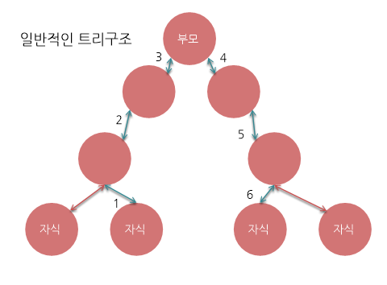
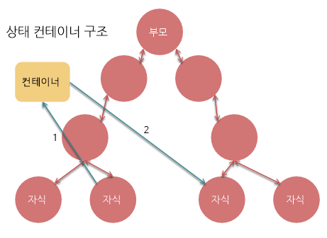

# 상태 컨테이너

트리구조에선 자식에서 자식으로 값을 전달할 때에는 먼저 부모에게 값을 전달하고, 하나하나 props들을 거치면서 이동하여 다른 자식으로 도착합니다. 상태컨테이너는 이러한 과정을 Skip할 수 있도록 도와주는 착한 아이입니다.

방금 전 과정을 상태컨테이너를 이용하면, props들을 거치지 않고, 자식에서 컨테이너로, 컨테이너에서 다른 자식으로 바로 이동하는 과정을 거치게 됩니다.  

한마디로 복잡한 과정을 한번에 수행 할 수 있도록 도와주는 형식 입니다. ~~핵사기인듯..~~ 

[Redux설명으로 돌아가기](https://github.com/junu126/Redux-tutorial)